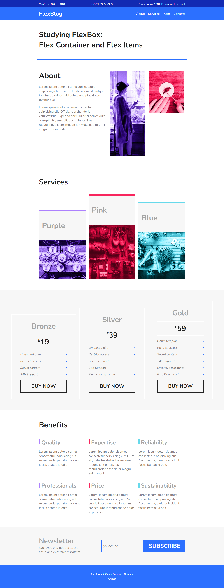
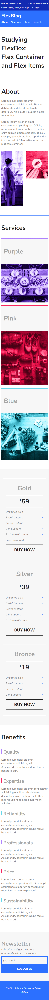

# FlexBlog - Origamid

Project created in the CSS Flexbox course from <a href="https://www.origamid.com/curso/css-flexbox/">Origamid </a>, a Brazilian online school that offers technology courses.
 

Flexbox properties like flex-wrap and flex (flex-grow, flex-shrink, and flex-basis) are used to make a responsive layout. 

### Desktop

  

### Mobile 

***
##### by Juliana Chagas 💜